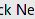
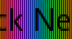
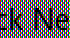

`subpixel` is a command to better see the subpixels in a screenshot. It creates a new image 3 times as big, where every pixel in the original image is displayed as the three color bands: R,G,B.

To compile:

```bash
git clone https://github.com/Gyscos/subpixel && cd subpixel
cargo build --release
```

Example usage:
```
$ target/release/subpixel screenshot.png
Loading file screenshot.png
Creating blank canvas: 5760 x 3240
Iterating
....................
Now saving image as screenshot.png.rgb.png
$ target/release/subpixel screenshot.png rgbw
Loading file screenshot.png
Creating blank canvas: 3840 x 2160
Iterating
....................
Now saving image as screenshot.png.rgbw.png
```

Performance-wise, it takes ~0.33s to process a 1080p screenshot into RGB on a i5-4690K.

Here are before/after images, scaled to have the same size (blurriness comes from browser upscaling):







Support for more subpixel pattern should be easy to implement, PR are welcome!
